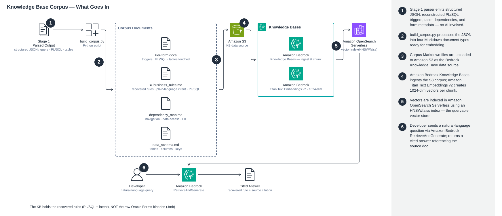

🇫🇷 Français | 🇬🇧 [English](ARCHITECTURE.md)

# Notes d'architecture et de conception

Ce document explique le fonctionnement du pipeline de migration GenAI et les décisions de
conception qui le sous-tendent. Pour la configuration et le déploiement, consultez le
[README](README.fr.md).

## Les quatre étapes

[](https://raw.githubusercontent.com/bennciz/oracleforms-to-angular/main/docs/architecture-pipeline.svg)

### Étape 1 — Analyse (déterministe, sans IA)

Les modules Oracle Forms hérités (`.fmb`) sont des binaires compilés, et les applications Oracle
APEX s'exportent sous forme d'un grand DSL PL/SQL (appels `wwv_flow_*`). L'étape 1 récupère la
structure et la logique **sans aucune IA**, ce qui la rend peu coûteuse, reproductible et
exécutable partout (Lambda, CI, votre poste de travail) :

- **`fmb_parser.py`** extrait les séquences imprimables du binaire `.fmb` avec des décalages
  d'octets. Le corps PL/SQL (`BEGIN … END;`) d'un déclencheur se trouve dans le flux
  immédiatement *avant* son marqueur de nom ; l'analyseur associe le corps au marqueur et
  compte en profondeur les `BEGIN/IF/LOOP` par rapport aux `END` pour fermer proprement les
  blocs, en filtrant le bruit du magasin d'objets.
- **`apex_parser.py`** analyse le DSL d'export APEX (appels `create_*` ;
  `wwv_flow_string.join()` pour le PL/SQL multiligne) en pages, processus, validations et
  calculs.
- **`build_graph.py` / `apex_graph_corpus.py`** convertissent le JSON analysé et le DDL en un
  graphe de dépendances (navigation Form→Form, accès Form→Table, clés étrangères des tables,
  séquences) rendu sous la forme `graph.json/.md/.dot/.png`, avec une section
  « Règles métier récupérées ».

Récupérer les règles de manière déterministe (plutôt que de demander au modèle de « lire le code »)
fournit aux étapes suivantes une **source de vérité fiable et inspectable**.

### Étape 2 — Base de connaissances (RAG)

`build_corpus.py` convertit les règles récupérées en Markdown optimisé pour la recherche (docs
par écran, plus des docs sur les règles métier, la carte des dépendances et le schéma de données).
`provision_kb.py` provisionne, de manière idempotente :

- un compartiment source **S3** (SSE-KMS),
- une collection + un index VECTORSEARCH **Amazon OpenSearch Serverless** (HNSW/faiss, 1024 dim),
- une **Amazon Bedrock Knowledge Base** utilisant **Amazon Titan Text Embeddings v2**, et ingère
  le corpus.

`ask_kb.py` / `ask_apex.py` répondent ensuite aux questions en langage naturel avec citations
(`RetrieveAndGenerate`) — p. ex. « quelle est la formule du total de ligne ? » retourne le
`nvl(qty,0)*nvl(unit_price,0)` récupéré avec une référence de source.

#### Ce qui se retrouve réellement dans la base de connaissances

La base de connaissances est indexée sur les **règles récupérées et le schéma — et non les binaires `.fmb`
bruts.** `build_corpus.py` produit quatre types de documents Markdown, téléversés dans S3 comme source de
données de la base de connaissances :

| Document du corpus | Contenu |
|--------------------|---------|
| `form_<name>.md` (un par formulaire) | Chaque déclencheur + PL/SQL reconstruit + les tables/séquences/items qu'il touche |
| `business_rules.md` | Les règles métier récupérées — les déclencheurs de logique clés (`WHEN-VALIDATE-ITEM`, `ON-CHECK-DELETE-MASTER`, `PRE-INSERT`, `ON-POPULATE-DETAILS`, `POST-INSERT`, `WHEN-VALIDATE-RECORD`), chacun avec une ligne **Intent** en langage clair et le PL/SQL réel |
| `dependency_map.md` | Navigation formulaire→formulaire, accès aux données, clés étrangères |
| `data_schema.md` | Tables, colonnes, clés |

Un extrait de `business_rules.md` stocké ressemble à ceci (remarque : le PL/SQL est affiché en ligne pour
éviter les blocs de code imbriqués) :

```
## ORDERS — ON-CHECK-DELETE-MASTER (ORDERS)
Intent: Enforces a referential/validation rule and blocks the operation on failure.
PL/SQL: ... Message('Cannot delete master record when matching detail records exist.');
             RAISE Form_Trigger_Failure; ...
```

Bedrock KB intègre ces extraits avec **Amazon Titan Text Embeddings v2** (1024 dim) et stocke les vecteurs
dans **OpenSearch Serverless**, de sorte qu'une requête telle que *« quelle est la règle de suppression
pour les commandes ? »* retrouve cette règle précise avec une citation.

> **À propos des résumés d'intention :** la ligne `Intent:` est dérivée **heuristiquement** dans
> `build_corpus.py` par correspondance de motifs dans le corps du déclencheur (p. ex. `NEXTVAL` →
> clé primaire séquentielle, `:=` avec `*` → total calculé). Il s'agit d'une aide à la recherche,
> **non** d'une spécification faisant autorité — le contenu faisant autorité est le PL/SQL verbatim
> qui l'accompagne.

[](https://raw.githubusercontent.com/bennciz/oracleforms-to-angular/main/docs/knowledge-base-corpus.svg)

**Points d'attention intégrés :** Claude exige un ARN de **profil d'inférence** (un identifiant de
modèle brut retourne « on-demand throughput isn't supported ») ; la collection prend ~5 min pour
devenir active avant que la KB puisse être créée.

### Étape 3 — Génération

`generate.py` / `generate_apex.py` transmettent la logique récupérée à l'étape 1, le DDL et le
graphe de dépendances à **Amazon Bedrock (Anthropic Claude)** et produisent la pile cible de
phase 1 : une spécification OpenAPI, un service/contrôleur/DTOs .NET et un
composant/service/gabarit Angular. Deux décisions de conception sont importantes :

- **Un fichier par appel, texte brut — pas un seul grand JSON.** Forcer le modèle à produire
  du JSON `{chemin: source}` l'oblige à échapper les retours à la ligne et les guillemets sur
  des milliers de lignes ; au-delà de ~40 Ko, il glisse et toute la réponse échoue à
  `json.loads`. À la place, chaque fichier est généré dans son propre appel sous forme de
  source verbatim (un protocole de délimiteur `===FILE=== … ===ENDFILE===`), ce qui élimine
  tout échappement et rend chaque échec ponctuel facile à relancer. Augmenter `max_tokens` ne
  **résout pas** ce problème — c'est un problème de fragilité, pas de troncature.
- **Chaque règle récupérée est tracée dans la sortie.** Le .NET généré est une passerelle
  Dapper légère sur Oracle qui préserve chaque règle verbatim — PK basées sur des séquences,
  le total calculé `nvl(qty,0)*nvl(price,0)`, le garde « cannot delete master with children »
  mappé à un HTTP 409 avec le message d'origine, etc.

**Points d'attention intégrés :** le modèle rejette le paramètre `temperature` sur certains
profils (l'omettre) ; le délai de lecture botocore par défaut est trop court pour les grandes
générations, donc le client utilise `converse_stream` avec `read_timeout=900`.

### Étape 4 — Validation (équivalence + shadow)

`generate_tests.py` / `generate_apex_tests.py` retransmettent les règles récupérées et le code
généré au modèle pour produire des **suites `pytest` d'équivalence autonomes** ainsi qu'une
matrice de traçabilité `ACCEPTANCE_CRITERIA.md`. Dans cet exemple, les suites réussissent
**19/19** (commandes de détail) et **43/43** (détails de compte APEX), couvrant le total calculé
(y compris `None → 0`), la monotonie des PK séquentielles, le garde de suppression, les
validations d'étiquette/URL et les particularités de sensibilité à la casse.

**Étape 5 — Mode shadow** (`stage5_shadow/`) va plus loin : elle soumet les *mêmes* entrées à
deux oracles indépendants — les validations héritées lues verbatim depuis les métadonnées de
l'application déployée, exécutées par la base de données, **et** l'API .NET moderne en direct —
et compare chaque décision et chaîne d'erreur. C'est ainsi qu'un véritable écart de migration
(une règle de champ obligatoire manquante) a été trouvé, corrigé et re-vérifié lors du
développement initial. Une variante pilotée par navigateur conduit l'interface héritée réelle dans
Chrome sans interface graphique pour une parité de bout en bout.

## Orchestration & exécution

- **AWS Step Functions (STANDARD, pas Express).** Les appels Bedrock enchaînés avec réflexion
  étendue s'exécutent plusieurs minutes ; Express a un plafond strict de 5 minutes, donc le flux
  de travail utilise STANDARD. Les charges utiles de Step Functions transportent **uniquement
  des clés S3** (limite de 256 Ko) — seules les métadonnées circulent, jamais les données en bloc.
- **Exécution cible « après ».** [](https://raw.githubusercontent.com/bennciz/oracleforms-to-angular/main/docs/architecture-target.svg)
  La SPA Angular est servie via HTTPS depuis S3 par **CloudFront** ; CloudFront effectue aussi un
  reverse-proxy `/api/*` vers un service .NET **ALB → ECS Fargate**, de sorte que la SPA utilise
  des URL relatives **en même origine** (aucun contenu mixte, aucun CORS). L'API est une
  passerelle légère sur la base de données **Oracle** conservée ; une **Bedrock Knowledge Base**
  reste disponible pour les questions-réponses des développeurs.

## Gestion des données

Aucune donnée de production n'est utilisée. Les entrées héritées sont des applications de
substitution publiques ([README §Les exemples d'applications héritées](README.fr.md#les-exemples-dapplications-héritées)).
Seules les métadonnées structurelles (source, dépendances, arguments) circulent dans le pipeline ;
les secrets proviennent d'**AWS Secrets Manager** / de variables d'environnement, jamais du code
source.

## Étendre l'exemple

- **Migrer un autre écran :** relancez l'étape 3 pour cette page/ce formulaire, puis construisez
  et déployez — c'est une question de volume, non de nouvelle capacité.
- **Changer de modèle :** modifiez l'identifiant du profil d'inférence dans les scripts des
  étapes 3 et 4.
- **Pointer vers votre propre application héritée :** remplacez `pipeline/sample-inputs/` par vos
  artefacts et relancez depuis l'étape 1.
