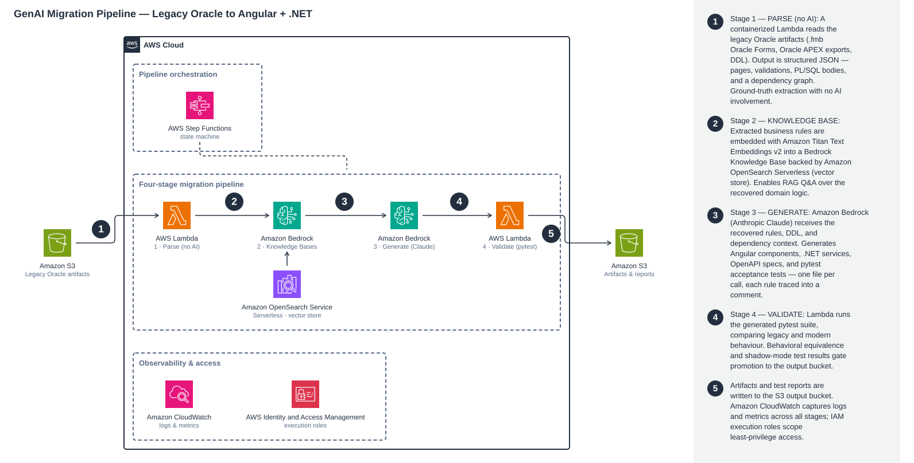
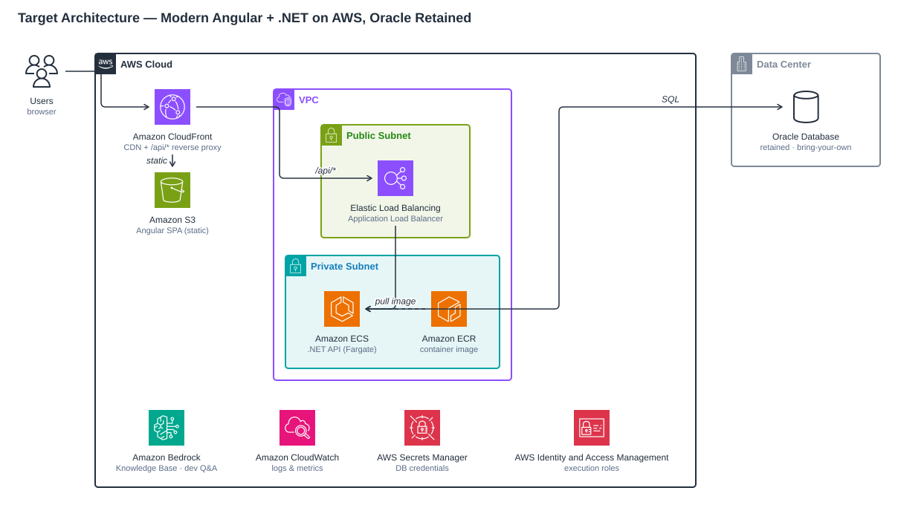

# Architecture &amp; Design Notes

🇬🇧 English | 🇫🇷 [Français](ARCHITECTURE.fr.md)

This document explains how the GenAI migration pipeline works and the design decisions behind
it. For setup and deployment see the [README](README.md).

## The four stages

### Stage 1 — Parse (deterministic, no AI)

Legacy Oracle Forms modules (`.fmb`) are compiled binaries, and Oracle APEX applications export
as a large PL/SQL DSL (`wwv_flow_*` calls). Stage 1 recovers structure and logic **without any
AI**, so it is cheap, reproducible, and runs anywhere (Lambda, CI, your laptop):

- **`fmb_parser.py`** extracts printable runs from the `.fmb` binary with byte offsets. A
  trigger's PL/SQL body (`BEGIN … END;`) sits in the stream immediately *before* its name
  marker; the parser associates the body with the marker and depth-counts
  `BEGIN/IF/LOOP` vs `END` to close blocks cleanly, filtering object-store noise.
- **`apex_parser.py`** parses the APEX export DSL (`create_*` calls; `wwv_flow_string.join()`
  for multi-line PL/SQL) into pages, processes, validations, and computations.
- **`build_graph.py` / `apex_graph_corpus.py`** turn the parsed JSON + DDL into a dependency
  graph (Form→Form navigation, Form→Table access, table FKs, sequences) rendered as
  `graph.json/.md/.dot/.png`, with a "Business Rules Recovered" section.

Recovering the rules deterministically (rather than asking the model to "read the code")
gives the later stages a **trustworthy, inspectable source of truth**.

### Stage 2 — Knowledge Base (RAG)

`build_corpus.py` turns the recovered rules into retrieval-optimized Markdown (per-screen docs
plus business-rules, dependency-map, and data-schema docs). `provision_kb.py` provisions,
idempotently:

- an **S3** source bucket (SSE-KMS),
- an **Amazon OpenSearch Serverless** VECTORSEARCH collection + index (HNSW/faiss, 1024-dim),
- an **Amazon Bedrock Knowledge Base** using **Amazon Titan Text Embeddings v2**, and ingests
  the corpus.

`ask_kb.py` / `ask_apex.py` then answer natural-language questions with citations
(`RetrieveAndGenerate`) — e.g. "what is the line-total formula?" returns the recovered
`nvl(qty,0)*nvl(unit_price,0)` with a source reference.

**Gotchas baked in:** Claude requires an **inference-profile** ARN (a bare model id returns
"on-demand throughput isn't supported"); the collection takes ~5 min to become active before
the KB can be created.

### Stage 3 — Generate

`generate.py` / `generate_apex.py` feed the Stage-1 recovered logic + DDL + dependency graph
to **Amazon Bedrock (Anthropic Claude)** and emit the Phase-1 target stack: an OpenAPI spec, a
.NET service/controller/DTOs, and Angular component/service/template. Two design decisions
matter:

- **One file per call, plain text — not one big JSON.** Forcing the model to emit
  `{path: source}` JSON makes it escape newlines/quotes across thousands of lines; past ~40 KB
  it slips and the whole reply fails `json.loads`. Instead each file is generated in its own
  call as verbatim source (a `===FILE=== … ===ENDFILE===` delimiter protocol), so there is
  zero escaping and any single failure is cheap to retry. Raising `max_tokens` does **not** fix
  this — it is a fragility problem, not a truncation one.
- **Every recovered rule is traced into the output.** The generated .NET is a thin Dapper
  gateway over Oracle that preserves each rule verbatim — sequence-based PKs, the
  `nvl(qty,0)*nvl(price,0)` computed total, the "cannot delete master with children" guard
  mapped to an HTTP 409 with the original message, etc.

**Gotchas baked in:** the model rejects the `temperature` param on some profiles (omit it); the
default botocore read timeout is too short for large generations, so the client uses
`converse_stream` with `read_timeout=900`.

### Stage 4 — Validate (equivalence + shadow)

`generate_tests.py` / `generate_apex_tests.py` feed the recovered rules + the generated code
back to the model to emit **self-contained `pytest` equivalence suites** plus an
`ACCEPTANCE_CRITERIA.md` traceability matrix. In this sample the suites pass **19/19** (retail
Orders) and **43/43** (APEX Account Details), covering the computed total (including
`None → 0`), sequence-PK monotonicity, the delete guard, tag/URL validations, and
case-sensitivity quirks.

**Stage 5 — Shadow mode** (`stage5_shadow/`) goes further: it runs the *same* inputs through
two independent oracles — the legacy validations read verbatim from the deployed app's own
metadata, executed by the database, **and** the live modern .NET API — and diffs every decision
and error string. It is how a genuine migration gap (a missing required-field rule) was found,
fixed, and re-verified in the original build. A browser-driven variant drives the real legacy
UI in headless Chrome for end-to-end parity.

## Orchestration &amp; runtime

- **AWS Step Functions (STANDARD, not Express).** The chained extended-thinking Bedrock calls
  run several minutes; Express has a hard 5-minute ceiling, so the workflow uses STANDARD.
  Step Functions payloads carry **S3 keys only** (256 KB limit) — only metadata moves, never
  bulk data.
- **Target "after" runtime.** 
  The Angular SPA is served over HTTPS from S3 via **CloudFront**; CloudFront also
  reverse-proxies `/api/*` to an **ALB → ECS Fargate** .NET service, so the SPA calls
  **same-origin** relative URLs (no mixed content, no CORS). The API is a thin gateway over the
  retained **Oracle** database; a **Bedrock Knowledge Base** remains available for developer
  Q&amp;A.

## Data handling

No production data is used. The legacy inputs are public stand-in applications
([README §The sample legacy apps](README.md#the-sample-legacy-apps)). Only structural metadata
(source, dependencies, arguments) flows through the pipeline; secrets come from **AWS Secrets
Manager** / environment variables, never source.

## Extending the sample

- **Migrate another screen:** re-run Stage 3 for that page/form, then build & deploy — it is
  volume, not new capability.
- **Swap the model:** change the inference-profile id in the Stage 3/4 scripts.
- **Point at your own legacy app:** replace `pipeline/sample-inputs/` with your artifacts and
  re-run from Stage 1.
